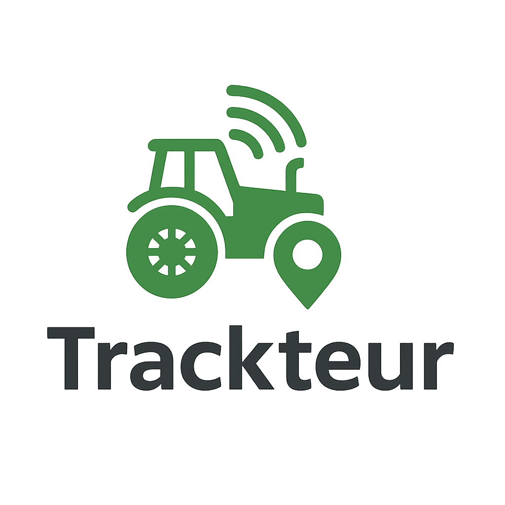

# Trackteur Analyse



> Analyse et visualisation des zones de travail depuis un serveur [Traccar](https://www.traccar.org/)

Trackteur Analyse interroge l'API Traccar, agrège les positions par jour et calcule les surfaces travaillées. 

Les résultats sont présentés dans une interface Web conviviale.

## Table des matières
1. [Fonctionnalités](#fonctionnalités)
2. [Prérequis](#prérequis)
3. [Installation](#installation)
4. [Configuration](#configuration)
5. [Utilisation](#utilisation)
6. [Production](#production)
7. [Structure du projet](#structure-du-projet)
8. [Contribution](#contribution)
9. [Licence](#licence)
10. [OsmAnd](#osmand)

## Fonctionnalités
- Authentification avec gestion d'un utilisateur administrateur
- Récupération des positions via l'API REST Traccar
- Génération de zones journalières (DBSCAN + alphashape)
- Visualisation cartographique dynamique (Leaflet) avec affichage interactif des zones
- Menu de navigation mois/année pour parcourir les analyses
- Analyse planifiée chaque nuit grâce à APScheduler
- Stockage des données dans `instance/trackteur.db`

## Prérequis
- Python 3.8 ou supérieur
- Serveur Traccar accessible et jeton d'API

## Installation

```bash
git clone <repo> && cd trackteur-analyse
pip install -r requirements.txt
```

## Configuration
Au premier lancement, ouvrez l'application dans votre navigateur. Un assistant se lance automatiquement pour :
1. Créer le compte administrateur
2. Saisir l'URL et le token du serveur Traccar
3. Choisir les appareils à suivre
4. Lancer une analyse initiale

Les paramètres saisis sont enregistrés dans la base de données et restent
disponibles au redémarrage. Vous pouvez néanmoins les fournir via les variables
`TRACCAR_AUTH_TOKEN` et `TRACCAR_BASE_URL` (et `TRACCAR_DEVICE_NAME` si besoin)
pour surcharger la configuration.

Seule la variable `FLASK_SECRET_KEY` est obligatoire. Pour éviter la longue
analyse initiale à chaque démarrage, vous pouvez définir
`SKIP_INITIAL_ANALYSIS=1`.

## Utilisation

Démarrer l'application :
```bash
# (optionnel) désactiver l'analyse initiale
export SKIP_INITIAL_ANALYSIS=1
python app.py
```
En production, utilisez [Gunicorn](https://gunicorn.org/) :
```bash
gunicorn wsgi:app --bind 0.0.0.0:8000
```
### Service systemd (Ubuntu)

Pour exécuter l'application comme un service systemd :

1. Créez `/etc/systemd/system/trackteur-analyse.service` :

   ```ini
   [Unit]
   Description=Trackteur Analyse
   After=network.target

   [Service]
   User=trackteur
   WorkingDirectory=/opt/trackteur-analyse
   Environment="FLASK_SECRET_KEY=changer"
   ExecStart=/usr/bin/gunicorn wsgi:app --bind 0.0.0.0:8000
   Restart=always

   [Install]
   WantedBy=multi-user.target
   ```

2. Rechargez systemd et démarrez le service :

   ```bash
   sudo systemctl daemon-reload
   sudo systemctl enable --now trackteur-analyse.service
   ```
Accédez à [http://localhost:5000](http://localhost:5000). La page d'accueil liste les équipements, leur dernière position et les surfaces calculées. Vous pouvez lancer une analyse manuelle ou consulter le détail d'un équipement (zones par jour et carte interactive). Une analyse automatique a lieu chaque nuit à 2 h.

## OsmAnd

En plus de Traccar, l’application peut ingérer des positions via un endpoint compatible OsmAnd.

- Endpoint: `POST /osmand` (JSON) ou `GET /osmand` (query)
- Authentification: par équipement via le champ `token_api` (facultatif). Si un token est renseigné sur l’équipement, il doit être fourni soit en paramètre `token=...`, soit dans l’en-tête `Authorization: Bearer ...` ou `X-Token: ...`.
- Appairage: créez un équipement OsmAnd dans la page Admin (champ “ID appareil”). Si un ID inconnu envoie des positions, un équipement est créé automatiquement avec `id_traccar=0` et `osmand_id`.

Exemples d’appels:

- Requête GET simple:

```
/osmand?deviceid=48241179&lat=45.1234&lon=3.9876&timestamp=2024-08-10T12:34:56Z&token=SECRETTOKEN
```

- JSON pour un seul appareil (optionnellement compressé en gzip avec `Content-Encoding: gzip`):

```
POST /osmand
Content-Type: application/json

{
  "device_id": "48241179",
  "locations": [
    { "coords": {"latitude": 45.12, "longitude": 3.98}, "timestamp": "2024-08-10T12:34:56Z" },
    { "latitude": 45.13, "longitude": 3.99, "timestamp": 1723290000 }
  ]
}
```
Le même JSON peut être envoyé compressé en gzip en ajoutant l'en-tête `Content-Encoding: gzip`.
Notes:

- Les timestamps acceptés: UNIX (en secondes ou millisecondes), ISO8601 (`...Z` ou `+00:00`), ou `YYYY-MM-DD HH:MM:SS`.
- Les champs `latitude`/`longitude` peuvent être fournis soit directement, soit via `coords: { latitude, longitude }`.
- Le champ optionnel `battery` (ou `batt`) permet de transmettre le niveau de batterie de l'appareil. Il peut être un nombre (0‑100 ou 0–1) ou un objet `{ "level": ... }` ; seule la valeur de `level` est prise en compte.
- L’ingestion OsmAnd met à jour `Equipment.last_position` et ajoute des lignes `Position` mais ne déclenche pas d’analyse immédiate (elle reste planifiée).
- Lors du polling Traccar, si les positions contiennent `batteryLevel` ou `battery` dans `attributes`, ce niveau est également enregistré.

## Production

Voici les recommandations et étapes pour un déploiement sécurisé :

- Reverse proxy HTTPS:
  - Terminer TLS (nginx/traefik) devant l’app (Gunicorn).
  - Forcer HTTPS et ajouter `Strict-Transport-Security` (déjà géré si `FORCE_HTTPS=1`).

- Variables d’environnement clés:
  - `FLASK_SECRET_KEY`: clé secrète obligatoire (longue et aléatoire).
  - `TRACCAR_AUTH_TOKEN`, `TRACCAR_BASE_URL` (et `TRACCAR_DEVICE_NAME` optionnel) pour l’accès Traccar.
  - `TRACCAR_TIMEOUT` (par défaut 10s) pour borner les appels réseau.
  - `SECURE_COOKIES=1` pour sécuriser les cookies (`Secure`, `SameSite=Lax`).
  - `SESSION_COOKIE_SAMESITE` pour ajuster la stratégie (`Lax`/`Strict`).
  - `START_SCHEDULER=0` dans les workers web; lancer la tâche planifiée dans un processus dédié (voir ci‑dessous).
  - `SKIP_INITIAL_ANALYSIS=1` pour éviter l’analyse initiale au boot si non désirée.
  - `SETUP_DISABLED=1` pour désactiver l’assistant `/setup` en production après initialisation.
  - (Optionnel) `LOGIN_MAX_ATTEMPTS` (défaut 10), `LOGIN_WINDOW_SECONDS` (défaut 900) pour le rate‑limit de `/login`.

- Scheduler (analyse quotidienne):
  - Ne démarrez PAS l’APScheduler dans tous les workers.
  - Lancer un seul processus dédié avec `START_SCHEDULER=1`, et `START_SCHEDULER=0` ailleurs.
  - Alternativement, exécuter l’analyse via un cron/worker externe qui appelle une commande dédiée (à ajouter si besoin).

- Lancement service (exemple):
  - Web: `START_SCHEDULER=0 SECURE_COOKIES=1 gunicorn wsgi:app -w 2 -b 0.0.0.0:8000`
  - Scheduler: `START_SCHEDULER=1 SECURE_COOKIES=1 gunicorn wsgi:app -w 1 -b 127.0.0.1:8001`

- Bonnes pratiques sécurité:
  - Ne jamais utiliser `python app.py` en prod (debugger Werkzeug dangereux).
  - Masquer le token Traccar (l’UI n’affiche plus la valeur enregistrée).
  - Les actions mutantes utilisent POST + CSRF (déconnexion, relance d’analyse).
  - `points.geojson` plafonné pour prévenir les abus; limitez l’accès ou activez du rate‑limit au besoin.

- Sauvegarde/stockage:
  - La base SQLite est stockée sous `instance/trackteur.db`. Sauvegardez‑la régulièrement.
  - Protégez le dossier `instance/` (droits système), et éviter de l’exposer au serveur HTTP.

## Structure du projet
```
app.py         - Application Flask et routes principales
models.py      - Modèles SQLAlchemy
zone.py        - Récupération et traitement des positions
templates/     - Gabarits HTML (index, login, administration, équipement, assistant)
static/        - Export de carte Leaflet `carte_passages.html` et logo
```

## Contribution
Les issues et pull requests sont bienvenues pour signaler un bug ou proposer des améliorations.

## Licence
Ce projet est distribué sous licence [MIT](LICENSE).
